# Chapter 1. Visual Studio 설치와 Hello World 출력

## 1. Visual Studio 설치하기

1. **Visual Studio 다운로드**
   - [Visual Studio 공식 홈페이지](https://visualstudio.microsoft.com/ko/downloads/)에 접속합니다.
   - "무료 다운로드" 버튼을 클릭하여 "Community" 버전을 다운로드합니다.
   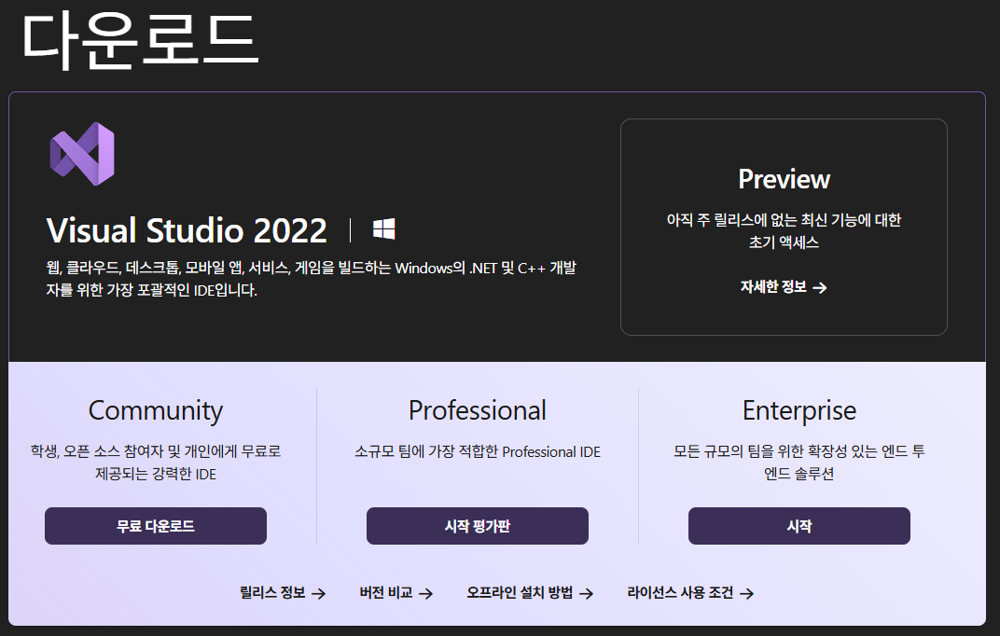

2. **설치 프로그램 실행**
   - 다운로드한 설치 파일을 실행합니다.
   - "C++를 사용한 데스크톱 개발" 워크로드를 선택합니다. (C언어도 C++ 워크로드에 포함되어 있습니다)
      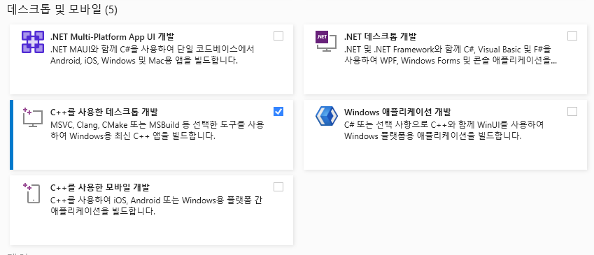
   - "설치" 버튼을 눌러 설치를 진행합니다.
   

3. **설치 완료 후 Visual Studio 실행**
   - 설치가 완료되면 Visual Studio를 실행합니다.
   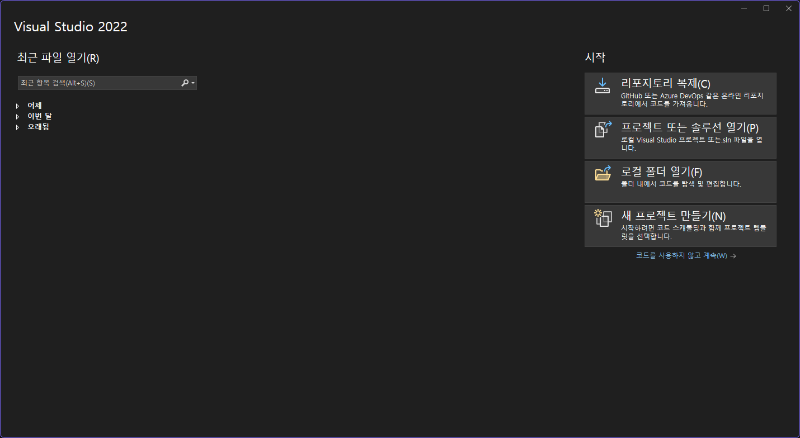
---

## 2. 새 프로젝트 만들기

1. **새 프로젝트 생성**
   - Visual Studio를 실행한 후, "새 프로젝트 만들기"를 클릭합니다.
   - "빈 프로젝트(Empty Project)"를 선택한 후 "다음"을 클릭합니다.
      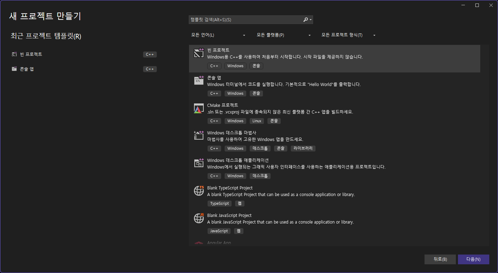

2. **솔루션 및 프로젝트 이름 지정**
   - 솔루션 이름을 입력합니다(예: clang)
   - 프로젝트 이름을 입력합니다(예: helloWorld).
   - 저장 위치를 지정한 후 "만들기"를 클릭합니다.
      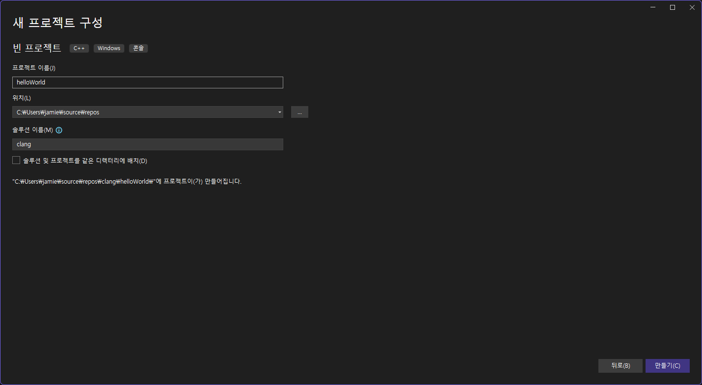

3. **C 소스 파일 추가**
   - 솔루션 탐색기에서 "소스 파일" 폴더를 마우스 오른쪽 버튼으로 클릭 → "추가" → "새 항목"을 선택합니다.
      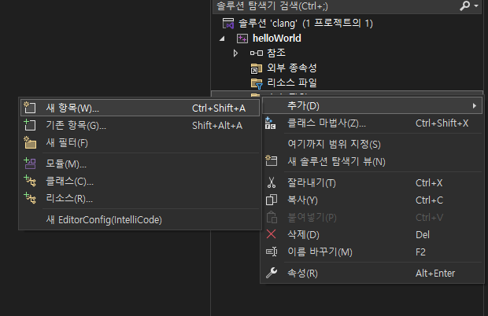
   - "C++ 파일(.cpp)"이 기본으로 보이지만, 파일 이름을 반드시 `.c`로 끝나게 입력하세요. (예: `main.c`)
   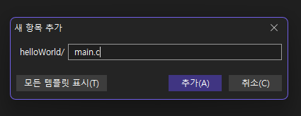
   - "추가"를 클릭합니다.

---

## 3. Hello World 코드 작성

1. **기본 코드 작성**
   - 생성한 `main.c` 파일에 아래와 같이 코드를 작성합니다.

```c
#include <stdio.h>

int main() {
    printf("Hello, World!\n");
    return 0;
}
```

2. **코드 저장**
   - Ctrl + S를 눌러 코드를 저장합니다.

---

## 4. 프로그램 빌드 및 실행

1. **빌드**
   - 상단 메뉴에서 "디버그" → "디버깅하지 않고 시작(Ctrl+F5)"을 클릭합니다.

2. **실행 결과 확인**
   - 콘솔 창에 `Hello, World!`가 출력되는지 확인합니다.
   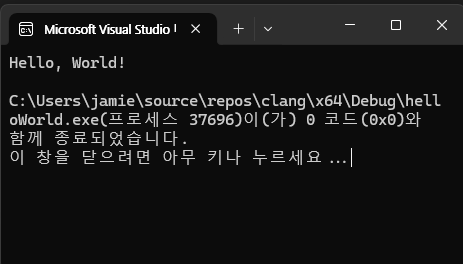
---

## 5. Visual Studio의 화면 구성

Visual Studio(이하 VS)는 마이크로소프트에서 제공하는 강력한 통합 개발 환경(IDE)입니다. VS의 기본 화면은 다음과 같이 구성되어 있습니다.

.png>)
- **메뉴 바(Menu Bar)**: 파일, 편집, 보기, 프로젝트 등 다양한 명령을 선택할 수 있는 메뉴가 위치합니다.
- **도구 모음(Toolbar)**: 자주 사용하는 명령을 아이콘 형태로 빠르게 실행할 수 있습니다.
- **솔루션 탐색기(Solution Explorer)**: 현재 작업 중인 솔루션과 프로젝트, 파일 구조를 트리 형태로 보여줍니다.
- **코드 편집기(Code Editor)**: 실제로 코드를 작성하는 공간입니다. 다양한 언어를 지원하며, 구문 강조, 자동 완성 등의 기능이 있습니다.
- **출력(Output) 및 오류 목록(Error List) 창**: 빌드 결과, 오류, 경고 메시지 등을 확인할 수 있습니다.
---

## 6. Visual Studio 스타일 설정 방법

Visual Studio에서는 개발 환경을 본인 취향에 맞게 다양하게 꾸밀 수 있습니다.

1. **테마 변경**
   - 상단 메뉴에서 `도구 > 옵션`을 클릭합니다.
   - `환경 > 일반`에서 테마(밝은 테마, 어두운 테마 등)를 선택할 수 있습니다.
      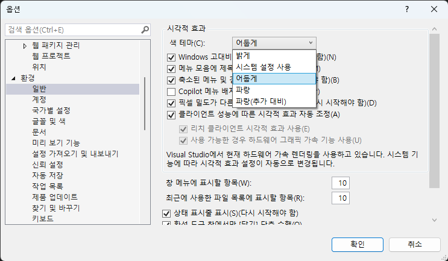
2. **글꼴 및 글자 크기 변경**
   - `도구 > 옵션`에서 `환경 > 글꼴 및 색`을 선택합니다.
   - '표시할 텍스트'에서 '코드 편집기'를 선택하면, 글꼴(Font)과 크기(Size)를 원하는 대로 변경할 수 있습니다.
   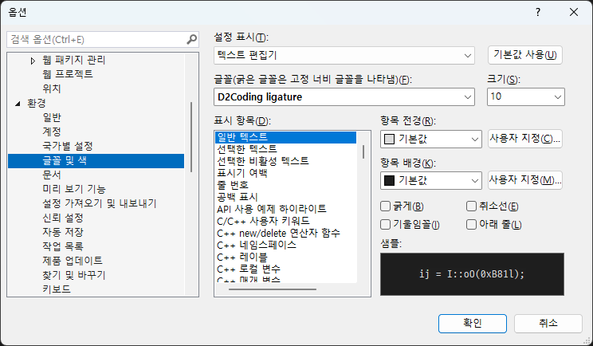
---

## 7. Visual Studio 자주 사용하는 단축키

- `Ctrl + Shift + B`: 솔루션 빌드(컴파일)
- `F5`: 디버깅 시작(프로그램 실행)
- `Ctrl + F5`: 디버깅 없이 실행
- `Ctrl + K, Ctrl + C`: 선택 영역 주석 처리
- `Ctrl + K, Ctrl + U`: 선택 영역 주석 해제
- `Ctrl + .`: 빠른 수정(Quick Actions) 메뉴 열기
- `F12`: 정의로 이동(Go to Definition)
- `Ctrl + Shift + F`: 전체 솔루션에서 찾기
- `Ctrl + Tab`: 열린 파일 간 빠른 전환
- `Ctrl + Space`: 인텔리센스(자동 완성) 수동 호출

이 외에도 다양한 단축키가 있으니, 자주 사용하는 기능의 단축키를 익혀두면 개발 속도가 크게 향상됩니다.

---

## 8. 솔루션(Solution)과 프로젝트(Project)란?

- **솔루션(Solution)**: 하나 이상의 프로젝트를 포함할 수 있는 상위 개념입니다. 예를 들어, 하나의 프로그램을 만들 때 여러 개의 프로젝트(실행 파일, 라이브러리, 테스트 등)를 하나의 솔루션으로 관리할 수 있습니다. 솔루션 파일의 확장자는 `.sln`입니다.
- **프로젝트(Project)**: 실제로 소스 코드, 리소스, 설정 파일 등이 포함된 단위입니다. 각 프로젝트는 독립적으로 빌드될 수 있으며, 실행 파일(.exe), 라이브러리(.dll) 등 다양한 형태로 결과물을 만들 수 있습니다. 프로젝트 파일의 확장자는 언어에 따라 다르지만, C/C++의 경우 `.vcxproj`입니다.

### 예시
- **솔루션**: 'MyApp.sln' (하나의 솔루션)
  - **프로젝트1**: 'MyApp.exe' (실행 파일 프로젝트)
  - **프로젝트2**: 'MyLib.dll' (라이브러리 프로젝트)
  - **프로젝트3**: 'MyAppTest' (테스트 프로젝트)

이렇게 솔루션과 프로젝트를 활용하면 대규모 소프트웨어 개발 시 여러 구성 요소를 효율적으로 관리할 수 있습니다.

---

## 9. 솔루션에서 시작 프로젝트 설정 방법

하나의 솔루션에 여러 프로젝트가 있을 때, 실행(디버깅)할 기본 프로젝트(시작 프로젝트)를 지정할 수 있습니다.

1. 솔루션을 마우스 오른쪽 버튼으로 클릭하고, '속성'을 선택합니다.
2. '시작 프로젝트' 항목에서 '현재 선택 영역'을 체크하면 현재 편집중인 프로젝트가 실행됩니다.
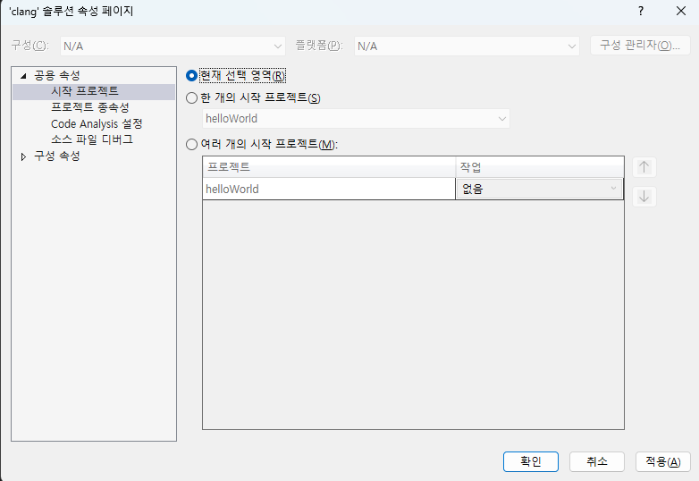