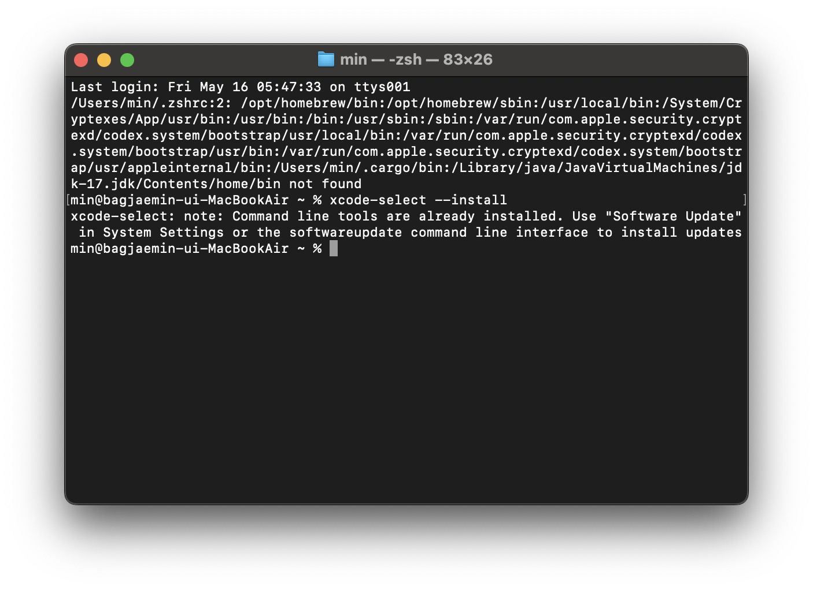
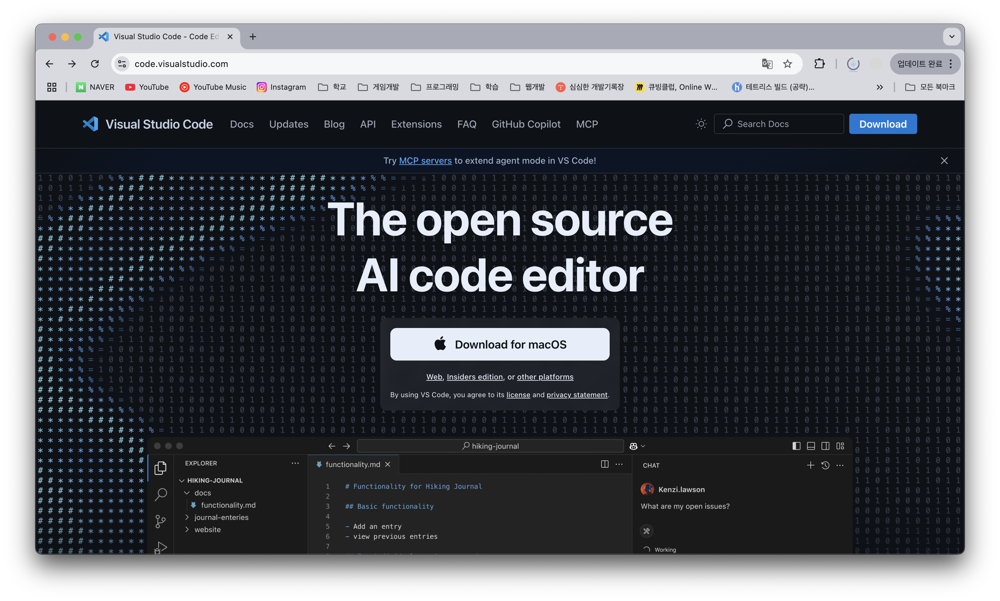
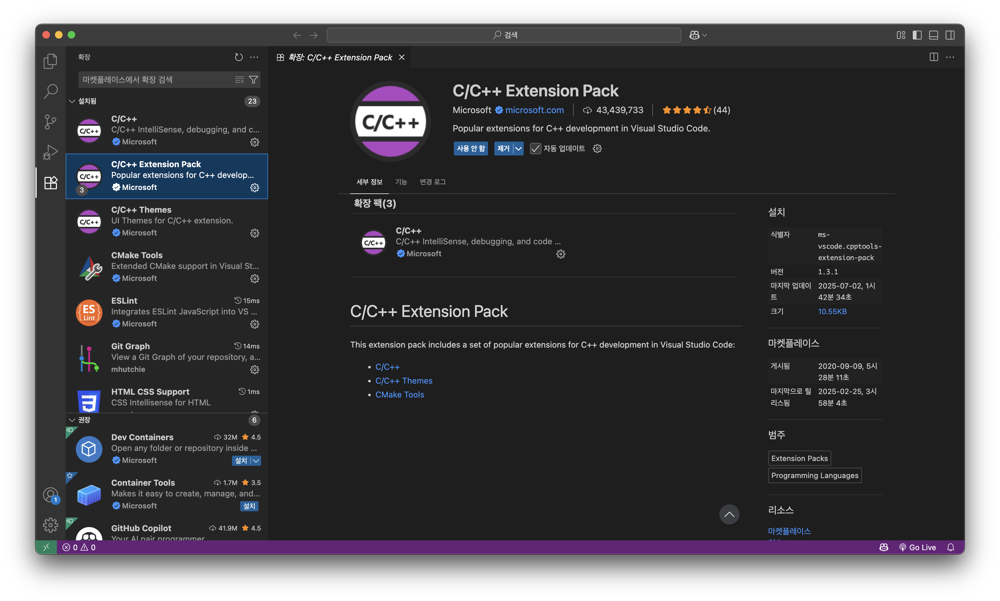

# Mac에서 VSCode로 C언어 개발 환경 구축하기

## 1. Xcode Command Line Tools 설치

터미널을 열고 아래 명령어를 입력하세요.

```bash
xcode-select --install
```

- 이 도구는 C 컴파일러(gcc/clang)를 포함하고 있습니다.
- 설치 창이 뜨면 "설치"를 눌러주세요.

---

## 2. VSCode 설치

- [VSCode 공식 사이트](https://code.visualstudio.com/)에서 Mac용 VSCode를 다운로드하여 설치하세요.

---

## 3. VSCode에서 C/C++ 확장 설치

1. VSCode를 실행합니다.
2. 왼쪽 메뉴에서 Extensions(확장) 아이콘(네모 4개)을 클릭합니다.
3. 검색창에 `C/C++`를 입력하고, `C/C++ Extension Pack`을 설치합니다.

---

## 4. C 파일 생성 및 컴파일

1. 원하는 폴더를 열고, 간단한 `.c` 파일을 만듭니다. 예시: `hello.c`
2. 아래와 같이 간단한 코드를 작성해보세요.

```c
#include <stdio.h>

int main() {
    printf("Hello, World!\n");
    return 0;
}
```

---

## 5. 터미널에서 컴파일 및 실행

1. VSCode에서 상단 메뉴 → `터미널` → `새 터미널`을 클릭합니다.
2. 아래 명령어로 컴파일합니다.

```bash
gcc hello.c -o hello
```

3. 아래 명령어로 실행합니다.

```bash
./hello
```

---

## 6. 빌드 및 실행을 더 쉽게: tasks.json 설정

매번 명령어를 입력하는 것이 번거롭다면, 아래처럼 자동화할 수 있습니다.

1. 작업할 폴더에 .vscode 폴더 생성
2. .vscode 폴더 내부에 tasks.json파일 생성 후 아래 내용 붙혀넣기

```json
{
    "version": "2.0.0",
    "tasks": [
        {
            "label": "C Build & Run",
            "type": "shell",
            "command": "gcc ${file} -o ${fileDirname}/${fileBasenameNoExtension} && ${fileDirname}/${fileBasenameNoExtension}",
            "group": {
                "kind": "build",
                "isDefault": true
            },
            "problemMatcher": ["$gcc"],
            "detail": "컴파일 후 실행"
        }
    ]
}
```
3. 이제 `Cmd + Shift + B`를 누르면 자동으로 컴파일 및 실행됩니다.