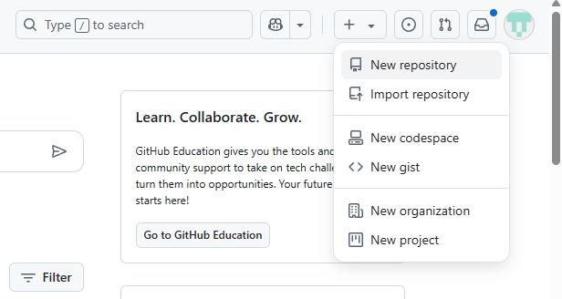
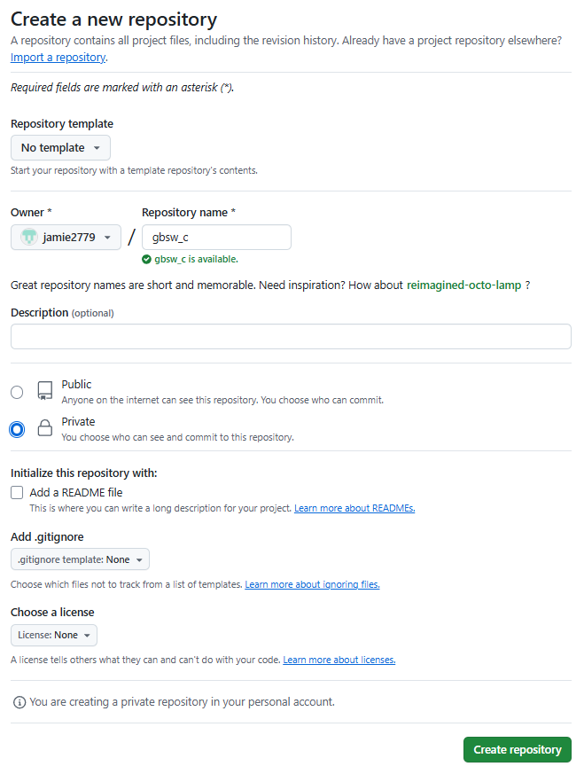
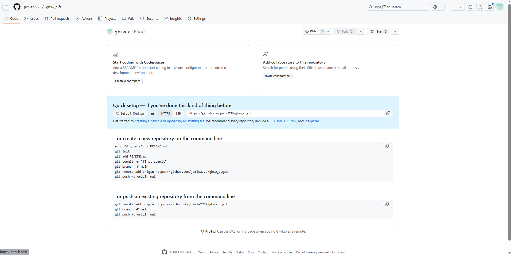
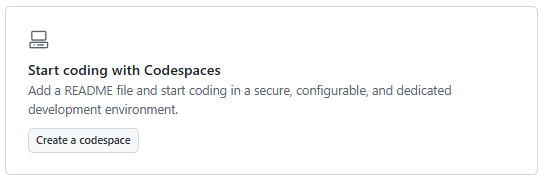
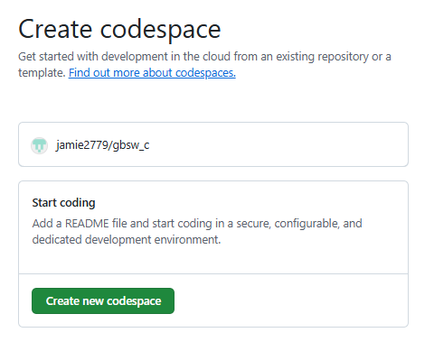
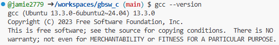
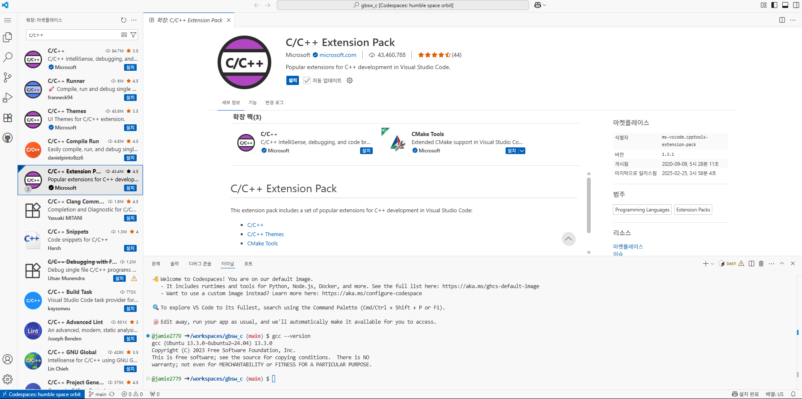

# GitHub Codespaces를 활용한 C언어 개발환경 세팅 방법

## 1. GitHub 계정 만들기
- [GitHub 가입 페이지](https://github.com/join)에서 계정을 생성합니다.


## 2. 새 레포지토리(저장소) 생성하기
1. [GitHub 메인 페이지](https://github.com)에 로그인합니다.
2. 오른쪽 상단의 `+` 버튼을 클릭하고, `New repository`를 선택합니다.

3. 저장소 이름(예: `gbsw_c`)을 입력하고, `Public` 또는 `Private`을 선택합니다.
4. `Create repository` 버튼을 클릭합니다.


## 3. Codespaces 생성하기
1. 방금 만든 저장소의 메인 페이지로 이동합니다.

2. `Create a codespace` 버튼을 클릭합니다.

3. 초록색 `Create new codespace` 버튼을 클릭합니다.

4. 잠시 기다리면 웹 브라우저에서 Visual Studio Code 환경이 자동으로 실행됩니다.

## 4. C 컴파일러 설치 확인
- Codespaces는 Ubuntu 기반이므로, 터미널에서 아래 명령어로 gcc가 설치되어 있는지 확인합니다.
  ```bash
  gcc --version
  ```
  
- 만약 설치되어 있지 않다면, 아래 명령어로 설치합니다.
  ```bash
  sudo apt update
  sudo apt install build-essential
  ```

## 5.  C/C++ 확장 설치

1. 왼쪽 메뉴에서 Extensions(확장) 아이콘(네모 4개)을 클릭합니다.
2. 검색창에 `C/C++`를 입력하고, `C/C++ Extension Pack`을 설치합니다.

---

## 6. C 파일 생성 및 컴파일

1. 간단한 `.c` 파일을 만듭니다. 예시: `hello.c`
2. 아래와 같이 간단한 코드를 작성해보세요.

```c
#include <stdio.h>

int main() {
    printf("Hello, World!\n");
    return 0;
}
```

---

## 7. 터미널에서 컴파일 및 실행
1. 터미널에서 아래 명령어를 입력하여 컴파일합니다.

```bash
gcc hello.c -o hello
```

3. 아래 명령어로 실행합니다.

```bash
./hello
```

---

## 8. 빌드 및 실행을 더 쉽게: tasks.json 설정

매번 명령어를 입력하는 것이 번거롭다면, 아래처럼 자동화할 수 있습니다.

1. .vscode 폴더 생성
2. .vscode 폴더 내부에 tasks.json파일 생성 후 아래 내용 붙혀넣기

```json
{
    "version": "2.0.0",
    "tasks": [
        {
            "label": "C Build & Run",
            "type": "shell",
            "command": "gcc ${file} -o ${fileDirname}/${fileBasenameNoExtension} && ${fileDirname}/${fileBasenameNoExtension}",
            "group": {
                "kind": "build",
                "isDefault": true
            },
            "problemMatcher": ["$gcc"],
            "detail": "컴파일 후 실행"
        }
    ]
}
```
3. 이제 `Cmd + Shift + B`를 누르면 자동으로 컴파일 및 실행됩니다.
---