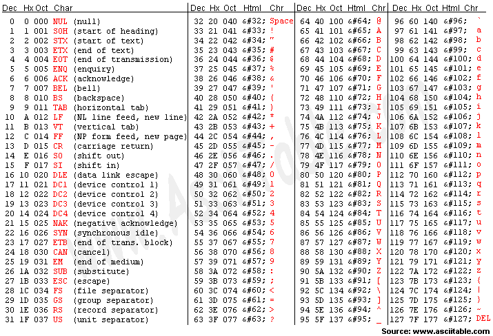

# 진법과 자료형 이해하기

---

## 1. 진법이란?
- **진법**은 숫자를 세는 방법입니다.
- 우리가 평소에 사용하는 숫자는 10진법(0~9까지 10개 숫자)입니다.
- 컴퓨터는 2진법(0, 1만 사용)을 사용합니다.

### 진법별 예시
| 진법 | 사용하는 숫자 | 예시 | C언어에서 쓰는 방법 |
|------|----------------|------|-------------------|
| 2진법 | 0, 1 | 1011 | 0b1011 (C99 이상) |
| 8진법 | 0~7 | 17 | 021 |
| 10진법 | 0~9 | 123 | 123 |
| 16진법 | 0~9, A~F | 1A | 0x1A |

---

## 2. 진법 변환 쉽게 이해하기
- **2진수 → 10진수**: 각 자리 숫자에 2, 4, 8처럼 2씩 곱해서 더합니다.
  - 예: 1011(2진수) = 1×8 + 0×4 + 1×2 + 1×1 = 11(10진수)
- **10진수 → 2진수**: 2로 계속 나누고, 나머지를 거꾸로 적습니다.
  - 예: 13(10진수) → 1101(2진수)
- **16진수 → 2진수**: 한 자리씩 4칸(비트)로 바꿉니다.
  - 예: 0x1A = 0001 1010(2진수)

---

## 3. C언어 진법별 변수 선언 예제

C언어에서 int형 변수에 다양한 진법으로 값을 저장할 때는 아래와 같은 접두사(prefix)를 사용합니다.
- 2진수: `0b`로 시작
- 8진수: `0`(숫자 0)으로 시작
- 10진수: 접두사 없음
- 16진수: `0x`로 시작

| 진법   | 예시      | C언어 표기법(접두사) |
|--------|-----------|----------------------|
| 2진수  | 1011      | 0b1011    |
| 8진수  | 17        | 021                  |
| 10진수 | 123       | 123                  |
| 16진수 | 1A        | 0x1A                 |

### 예제 코드
```c
#include <stdio.h>

int main() {
    int bin = 0b1011;    // 2진수(11)
    int oct = 021;       // 8진수(17)
    int dec = 123;       // 10진수(123)
    int hex = 0x1A;      // 16진수(26)

    printf("2진수 0b1011 = %d\n", bin);
    printf("8진수 021 = %d\n", oct);
    printf("10진수 123 = %d\n", dec);
    printf("16진수 0x1A = %d\n", hex);
    return 0;
}
```

---

## 4. 데이터 크기의 단위
- **비트(bit)**: 0 또는 1, 컴퓨터가 기억할 수 있는 가장 작은 단위입니다.
- **바이트(byte)**: 8비트가 모이면 1바이트가 됩니다.
- **KB(킬로바이트)**: 1,024바이트입니다.
- **MB(메가바이트)**: 1,024KB입니다.
- **GB(기가바이트)**: 1,024MB입니다.

---

## 5. 변수와 메모리
- 변수를 선언하면, 컴퓨터가 값을 저장할 공간을 마련합니다.
- 예시:
  ```c
  int a = 10; // 숫자 10을 저장할 공간
  char c = 'A'; // 문자 A를 저장할 공간
  ```
- `int`는 보통 4바이트, `char`는 1바이트를 차지합니다.
- 컴퓨터는 이 값을 0과 1(2진수)로 변환해서 메모리에 저장합니다.

---

## 6. 아스키 코드란?
- **아스키 코드(ASCII)**는 컴퓨터에서 문자를 숫자로 표현하는 표준입니다.

- 예를 들어, 대문자 'A'는 65, 소문자 'a'는 97, 숫자 '0'은 48로 저장됩니다.
- C언어에서 `char`형 변수에 숫자를 저장하면 해당 아스키 코드에 해당하는 문자가 출력됩니다.
- 예시:
  ```c
  char c = 65;
  printf("%c\n", c); // 출력: A
  ```

---

## 7. 2의 보수란?
- **2의 보수**는 컴퓨터가 음수를 표현할 때 사용하는 방법입니다.
- 예를 들어, 8비트(1바이트)로 숫자를 표현할 때,
  - 10진수 5는 0000 0101(2진수)로 저장됩니다.
  - -5를 저장하려면, 5의 2의 보수를 구해서 저장합니다.
- **2의 보수 구하는 방법**
  1. 해당 숫자의 2진수를 쓴다. (예: 5 → 0000 0101)
  2. 각 비트를 반전(0↔1)시킨다. (1111 1010)
  3. 1을 더한다. (1111 1010 + 1 = 1111 1011)
  - 즉, 1111 1011이 -5를 의미합니다.
- **장점**: 덧셈/뺄셈 연산을 동일한 회로로 처리할 수 있어 컴퓨터가 계산하기 쉽습니다.

---

## 8. 부동소수점이란?
- **부동소수점(Floating Point)**은 소수점이 있는 실수(예: 3.14, -0.001 등)를 컴퓨터에서 표현하는 방법입니다.
- **표현 방식**: 과학적 표기법(예: 1.23 × 10^4)처럼, 숫자를 '가수'와 '지수'로 나눠서 저장합니다.
- **C언어에서의 예시**
  - `float`(4바이트), `double`(8바이트) 등이 부동소수점 타입입니다.
  - 예: `float f = 3.14;`
- **IEEE 754 표준**
  - 대부분의 컴퓨터는 IEEE 754라는 규칙에 따라 부동소수점을 저장합니다.
  - 예를 들어, 32비트 float는
    - 1비트(부호) + 8비트(지수) + 23비트(가수)로 구성됩니다.
- **주의점**
  - 부동소수점은 근사값이기 때문에, 정확한 값이 아닌 경우가 많습니다.
  - 예: 0.1 + 0.2가 0.3이 되지 않는 현상

---

## 9. C언어 부동소수점 오차 예제

부동소수점(float, double)은 근사값으로 저장되기 때문에, 연산 결과가 우리가 기대하는 값과 다를 수 있습니다.

### 예제 코드
```c
#include <stdio.h>

int main() {
    float a = 0.1f;
    float b = 0.2f;
    float c = a + b;

    printf("0.1 + 0.2 = %.20f\n", c); // 소수점 20자리까지 출력
    if (c == 0.3f) {
        printf("정확히 0.3입니다.\n");
    } else {
        printf("0.3이 아닙니다! (부동소수점 오차)\n");
    }
    return 0;
}
```

- 위 코드를 실행하면 0.1 + 0.2가 정확히 0.3이 아닌 것을 확인할 수 있습니다.
- 이는 컴퓨터가 실수를 2진수로 근사하여 저장하기 때문입니다.

---

## 10. 진법과 자료형 퀴즈

1. 2진수 1101을 10진수로 변환하면?

2. 10진수 25를 2진수로 바꾸면?

3. 16진수 0x2F는 10진수로 얼마인가?

4. 8비트로 -7을 2의 보수로 표현하면? (10진수 7의 2진수: 0000 0111)

5. 2의 보수로 표현된 8비트 값 1111 1100은 10진수로 얼마인가?

6. 아래 C언어 코드의 실행 결과는?

```c
#include <stdio.h>

int main() {
    int a = 0x0F;
    int b = 021;
    int c = a + b;
    printf("%d\n", c);
    return 0;
}
```

7. C언어에서 int형 변수는 보통 몇 바이트를 차지하나요?

8. char형 변수에 저장할 수 있는 값의 범위는 무엇인가요?

9. 아래 코드에서 출력되는 값은?

```c
#include <stdio.h>

int main() {
    char c = 65;
    printf("%c\n", c);
    return 0;
}
```

