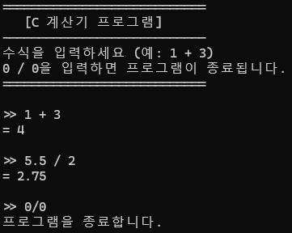
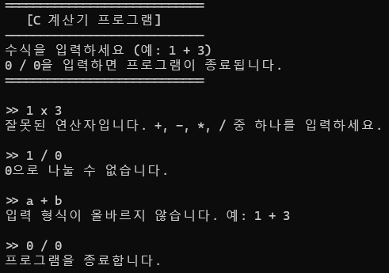

# Day4: C언어 계산기 프로젝트 (공백 구분, 배열 없이)

---

## 1. Day1~Day3 학습 내용 정리

### Day1: C언어 기초
- C언어 프로그램의 기본 구조 (main 함수, 중괄호, 세미콜론)
- 변수 선언과 데이터 타입 (int, float, char)
- printf, scanf를 이용한 입력과 출력
- 주석 작성 방법 (//, /* */)

### Day2: 연산과 조건, 반복
- 산술 연산자 (+, -, *, /, %)
- 대입 연산자 (=)
- 비교 연산자 (==, !=, >, <, >=, <=)
- 논리 연산자 (&&, ||, !)
- if, else if, else를 이용한 조건문
- switch문 기초
- while, for, do-while 반복문

### Day3: 배열과 예외처리
- 배열의 선언과 사용법 (int arr[5];)
- 반복문과 배열의 활용
- 입력값 검증(예외처리)의 필요성

---

## 2. 계산기 프로그램 상세 요구사항 (공백 구분, 배열 없이)

### 1. 프로그램 목적
- 사용자가 반드시 '숫자 공백 연산자 공백 숫자' 형식(예: 1 + 3, 1 - 2.3)으로 입력하면 해당 연산의 결과를 출력하는 콘솔 기반 계산기 프로그램을 작성한다.
- 프로그램은 사용자가 0 / 0을 입력할 때까지 반복 실행된다.
- 0 / 0이 입력되면 프로그램은 종료 메시지를 출력하고 즉시 종료된다.
- **문자열(배열) 사용 없이 scanf만으로 입력을 처리한다.**

---

### 2. 입력 및 동작 방식

#### 2.1. 입력 형식 및 방법
1. **수식 한 줄 입력**
   - "수식을 입력하세요 (예: 1 + 3)"라는 메시지를 출력한다.
   - 사용자는 실수, 연산자, 실수를 반드시 공백으로 구분하여 입력한다. (예: 1 + 3, 1.5 * 2.3)
   - 0 / 0을 입력하면 프로그램이 종료된다.
   - 배열(문자열) 없이 scanf("%lf %c %lf", ...)로 입력을 받는다.

#### 2.2. 연산 및 예외 처리
- 입력된 연산자에 따라 아래와 같이 동작한다.
  - **덧셈(+)**: 두 실수를 더한 결과를 출력한다.
  - **뺄셈(-)**: 두 실수를 뺀 결과를 출력한다.
  - **곱셈(*)**: 두 실수를 곱한 결과를 출력한다.
  - **나눗셈(/)**:
    - 두 번째 피연산자가 0.0이면, "0으로 나눌 수 없습니다."를 출력하고 다시 입력을 받는다.
    - 단, 0 / 0이 입력되면 프로그램을 종료한다.
    - 0이 아니면, 두 실수를 나눈 결과를 출력한다.
- 연산자는 +, -, *, / 중 하나만 허용한다. 이외의 연산자는 "잘못된 연산자입니다. +, -, *, / 중 하나를 입력하세요."를 출력한다.
- 입력 형식이 올바르지 않으면 "입력 형식이 올바르지 않습니다. 예: 1 + 3"을 출력한다.

#### 2.3. 결과 출력
- 연산 결과는 아래와 같은 형식으로 출력한다.
  - 예: 1 + 3 입력 시 → "= 4"
  - 예: 5.5 / 2 입력 시 → "= 2.75"
  - 소수점 아래 불필요한 0은 출력하지 않는다.

#### 2.4. 반복 및 종료
- 사용자가 0 / 0을 입력할 때까지 프로그램은 계속 실행된다.
- 0 / 0 입력 시 "프로그램을 종료합니다."를 출력하고 종료한다.

---

### 3. 예외 상황 및 처리

| 상황                      | 출력 메시지                                                    | 동작                                      |
|---------------------------|----------------------------------------------------------------|--------------------------------------------|
| 0 / 0 입력                | 프로그램을 종료합니다.                                         | 프로그램 종료                              |
| 입력 형식 오류             | 입력 형식이 올바르지 않습니다. 예: 1 + 3                       | 다시 입력 받음                             |
| 잘못된 연산자 입력         | 잘못된 연산자입니다. +, -, *, / 중 하나를 입력하세요.           | 다시 입력 받음                             |
| 0으로 나누기 시도          | 0으로 나눌 수 없습니다.                                        | 다시 입력 받음                             |

---

### 4. 입력/출력 예시

#### 정상 입력 예시


#### 예외 입력 예시

---

## 5. 구현 단계별 가이드

### 1단계: 프로그램 UI 및 안내 메시지 출력
- 프로그램 시작 시, 프로그램 이름, 사용법, 종료 방법을 안내하는 메시지를 출력한다.
- 예시:
  ```
  ============================
     [C 계산기 프로그램]   
  ----------------------------
  수식을 입력하세요 (예: 1 + 3)
  0 / 0을 입력하면 프로그램이 종료됩니다.
  ============================
  ```

### 2단계: 공백 구분 입력 및 종료 처리
- scanf("%lf %c %lf", ...)로 실수, 연산자, 실수를 공백으로 구분하여 입력받는다.
- 0 / 0이 입력되면 즉시 종료한다.
- 배열(문자열) 사용 없이 입력을 처리한다.

### 3단계: 입력값 검증 및 예외처리
- 입력값이 3개가 아니면 입력 형식 오류 메시지를 출력한다.
- 연산자가 +, -, *, / 중 하나인지 확인한다.
- 나눗셈에서 두 번째 피연산자가 0.0이면 예외 메시지를 출력한다.
- 단, 0 / 0이 입력되면 프로그램을 종료한다.

### 4단계: 연산 및 결과 출력
- switch-case문으로 연산을 수행한다.
- 결과는 "= 결과값" 형식으로 출력한다. (불필요한 0은 출력하지 않음)

### 5단계: 반복
- 위 과정을 사용자가 0 / 0을 입력할 때까지 반복한다.

---

## 6. 따라 만들기
<details>
<summary>먼저 직접 구현해보고 펼쳐보세요!</summary>
아래 단계별로 코드를 직접 따라 치면서, 계산기 프로그램을 완성해보세요!

### 1단계: 기본 구조와 변수 선언
```c
#include <stdio.h>

int main() {
    double a, b, answer;
    char op;
```
- `#include <stdio.h>`: 표준 입출력 함수 사용을 위한 헤더입니다.
- `double a, b, answer;` : 실수형 변수 3개 선언(입력값 2개, 결과 1개)
- `char op;` : 연산자 입력을 위한 문자형 변수
- `int quit = 0;` : 반복 종료를 위한 변수

### 2단계: 안내 메시지 출력
```c
    printf("============================\n");
    printf("   [C 계산기 프로그램]   \n");
    printf("----------------------------\n");
    printf("수식을 입력하세요 (예: 1 + 3)\n");
    printf("0 / 0을 입력하면 프로그램이 종료됩니다.\n");
    printf("============================\n");
```
- 프로그램 시작 시 사용자에게 안내 메시지를 출력합니다.

### 3단계: 입력받기 및 종료 조건 처리
```c
    while (1) {
        printf("\n>> ");
        int result = scanf("%lf %c %lf", &a, &op, &b);
        if (result != 3) {
            printf("입력 형식이 올바르지 않습니다. 예: 1 + 3\n");
            while (getchar() != '\n');
            continue;
        }
```
- `scanf`로 실수, 연산자, 실수를 공백으로 구분해 입력받습니다.
- 입력이 3개가 아니면 오류 메시지 출력 후 다시 입력받습니다.
- 입력 버퍼 비우기(`while (getchar() != '\n' && !feof(stdin));`)로 잘못된 입력 처리

### 4단계: 연산자 및 예외처리
```c
        if (op != '+' && op != '-' && op != '*' && op != '/') {
            printf("잘못된 연산자입니다. +, -, *, / 중 하나를 입력하세요.\n");
            continue;
        }
        // 0 / 0 입력 시 종료
        if (op == '/' && a == 0.0 && b == 0.0) {
            printf("프로그램을 종료합니다.\n");
            break;
        }
        // 0으로 나누기 예외처리
        if (op == '/' && b == 0.0) {
            printf("0으로 나눌 수 없습니다.\n");
            continue;
        }
```
- 연산자가 4개 중 하나가 아니면 오류 메시지 출력
- 0 / 0 입력 시 종료
- 0으로 나누기 시도 시 예외 메시지 출력

### 5단계: 연산 수행 및 결과 출력
```c
        switch (op) {
        case '+': answer = a + b; break;
        case '-': answer = a - b; break;
        case '*': answer = a * b; break;
        case '/': answer = a / b; break;
        }
        printf("= %.6g\n", answer);
    }
    return 0;
}
```
- switch문으로 연산을 수행하고, 결과를 출력합니다.
- `%.6g` 포맷은 불필요한 0 없이 결과를 출력합니다.
</details>
