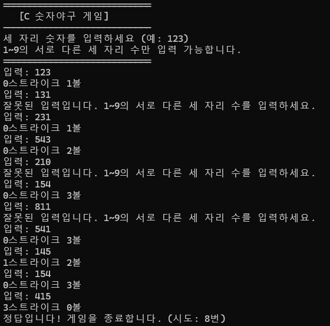

# Day4: C언어 숫자야구 프로젝트 (배열/함수 없이)

---

## 1. Day1~Day3 학습 내용 정리

### Day1: C언어 기초
- C언어 프로그램의 기본 구조 (main 함수, 중괄호, 세미콜론)
- 변수 선언과 데이터 타입 (int, float, char)
- printf, scanf를 이용한 입력과 출력
- 주석 작성 방법 (//, /* */)

### Day2: 연산과 조건, 반복
- 산술 연산자 (+, -, *, /, %)
- 대입 연산자 (=)
- 비교 연산자 (==, !=, >, <, >=, <=)
- 논리 연산자 (&&, ||, !)
- if, else if, else를 이용한 조건문
- switch문 기초
- while, for, do-while 반복문

### Day3: 예외처리
- 입력값 검증(예외처리)의 필요성
- 반복문과 조건문을 활용한 예외처리

---

## 2. 숫자야구 프로그램 상세 요구사항 (배열/함수 없이)

### 1. 프로그램 목적
- 컴퓨터가 1~9 사이의 서로 다른 세 자리 수(예: 123)를 랜덤으로 정한다.
- 사용자는 세 자리의 숫자를 입력하여 컴퓨터의 숫자와 자리와 숫자가 모두 맞으면 스트라이크, 숫자만 맞으면 볼로 판정한다.
- 3스트라이크가 될 때까지 반복해서 맞추는 게임이다.
- **배열과 함수 없이, 변수와 조건문, 반복문만 사용한다.**

---

### 2. 입력 및 동작 방식

#### 2.1. 랜덤 숫자 생성
- 1~9 사이의 서로 다른 세 개의 숫자를 각각 변수(예: a, b, c)에 저장한다.
- 중복되지 않도록 do-while문, if문을 활용한다.

#### 2.2. 사용자 입력
- "세 자리 숫자를 입력하세요 (예: 123):" 메시지를 출력한다.
- 사용자는 100~999 사이의 정수를 입력한다.
- 각 자리의 숫자를 분리하여 변수(예: x, y, z)에 저장한다.
- 각 자리 숫자가 모두 다르고, 1~9 사이인지 확인한다.
- 잘못된 입력(중복, 0포함, 범위 벗어남 등)은 "잘못된 입력입니다. 1~9의 서로 다른 세 자리 수를 입력하세요."를 출력하고 다시 입력받는다.

#### 2.3. 판정 및 출력
- 각 자리별로 컴퓨터 숫자와 사용자의 숫자를 비교한다.
- 자리와 숫자가 모두 맞으면 스트라이크, 숫자만 맞으면 볼로 판정한다.
- 예시: 컴퓨터 427, 입력 123 → 1볼(2), 1스트라이크(2자리 2)
- 결과는 "X스트라이크 Y볼" 형식으로 출력한다.
- 3스트라이크가 되면 "정답입니다! 게임을 종료합니다."를 출력하고 종료한다.

#### 2.4. 반복 및 종료
- 3스트라이크가 될 때까지 위 과정을 반복한다.

---

### 3. 예외 상황 및 처리

| 상황                      | 출력 메시지                                                    | 동작                                      |
|---------------------------|----------------------------------------------------------------|--------------------------------------------|
| 입력값이 100~999가 아님    | 잘못된 입력입니다. 1~9의 서로 다른 세 자리 수를 입력하세요.     | 다시 입력 받음                             |
| 각 자리 숫자 중복/0포함    | 잘못된 입력입니다. 1~9의 서로 다른 세 자리 수를 입력하세요.     | 다시 입력 받음                             |

---

### 4. 입력/출력 예시


---

## 5. [구현 단계별 가이드]

### 1단계: 프로그램 UI 및 안내 메시지 출력
- 프로그램 시작 시, 프로그램 이름, 사용법, 종료 조건을 안내하는 메시지를 출력한다.
- 예시:
  ```
  ============================
     [C 숫자야구 게임]   
  ----------------------------
  세 자리 숫자를 입력하세요 (예: 123)
  1~9의 서로 다른 세 자리 수만 입력 가능합니다.
  ============================
  ```

### 2단계: 랜덤 숫자 생성
- 1~9 사이의 서로 다른 세 개의 숫자를 각각 변수에 저장한다.
- 중복되지 않도록 do-while문, if문을 활용한다.

### 3단계: 사용자 입력 및 검증
- scanf("%d", &num)으로 입력받고, 각 자리 숫자를 분리한다.
- 각 자리 숫자가 1~9이고, 서로 다른지 확인한다.
- 잘못된 입력이면 예외 메시지를 출력하고 다시 입력받는다.

### 4단계: 판정 및 결과 출력
- 자리와 숫자가 모두 맞으면 스트라이크, 숫자만 맞으면 볼로 판정한다.
- 결과를 "X스트라이크 Y볼" 형식으로 출력한다.

### 5단계: 반복
- 3스트라이크가 될 때까지 반복한다.
- 3스트라이크가 되면 "정답입니다! 게임을 종료합니다."를 출력하고 종료한다.

---

## 6. 따라 만들기
<details>
<summary>먼저 직접 구현해보고 펼쳐보세요!</summary>

아래 단계별로 코드를 직접 입력하며 숫자야구 게임을 완성해보세요!

---

### 1단계: 기본 구조와 변수 선언

필요한 헤더파일과 변수들을 선언합니다.

```c
#include <stdio.h>
#include <stdlib.h>
#include <time.h>

int main() {
    int a, b, c; // 컴퓨터 숫자
    int num, x, y, z; // 사용자 입력 및 자리 분리
    int strike, ball;
    int try = 0;
```

---

### 2단계: 랜덤 시드 설정 및 컴퓨터 숫자 생성

랜덤 시드를 설정하고, 1~9 사이의 서로 다른 세 숫자를 뽑아 변수에 저장합니다.

```c
    srand((unsigned int)time(NULL));
    do {
        a = rand() % 9 + 1;
        b = rand() % 9 + 1;
        c = rand() % 9 + 1;
    } while (a == b || a == c || b == c);
```

---

### 3단계: 안내 메시지 출력

게임 시작 안내 메시지를 출력합니다.

```c
    printf("============================\n");
    printf("   [C 숫자야구 게임]\n");
    printf("----------------------------\n");
    printf("세 자리 숫자를 입력하세요 (예: 123)\n");
    printf("1~9의 서로 다른 세 자리 수만 입력 가능합니다.\n");
    printf("============================\n");
```

---

### 4단계: 사용자 입력, 자리 분리, 예외처리

사용자 입력을 받고, 각 자리 숫자를 분리한 뒤, 조건에 맞지 않으면 예외 메시지를 출력합니다.

```c
    while (1) {
        printf("입력: ");
        scanf("%d", &num);

        x = num / 100;
        y = (num / 10) % 10;
        z = num % 10;

        if (num < 100 || num > 999 || x == y || x == z || y == z || x == 0 || y == 0 || z == 0) {
            printf("잘못된 입력입니다. 1~9의 서로 다른 세 자리 수를 입력하세요.\n");
            continue;
        }
```

---

### 5단계: 스트라이크/볼 판정 및 결과 출력, 종료 조건

스트라이크/볼 판정 후 결과를 출력하고, 3스트라이크면 게임을 종료합니다.

```c
        strike = 0;
        ball = 0;

        if (x == a) strike++;
        if (y == b) strike++;
        if (z == c) strike++;

        if (x == b || x == c) ball++;
        if (y == a || y == c) ball++;
        if (z == a || z == b) ball++;

        printf("%d스트라이크 %d볼\n", strike, ball);
        try++;

        if (strike == 3) {
            printf("정답입니다! 게임을 종료합니다. (시도: %d번)\n", try);
            break;
        }
    }
    return 0;
}
```

</details>