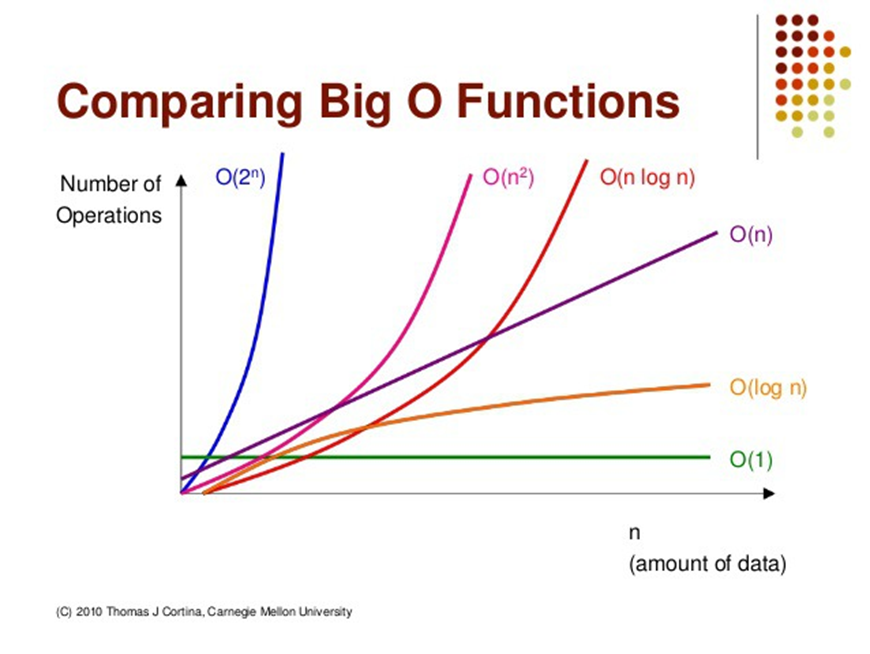

# 프로그램의 성능: 시간복잡도와 공간복잡도

---

## 1. 프로그램의 성능이란?

- **성능(Performance)**이란 프로그램이 얼마나 빠르고 효율적으로 동작하는지를 의미합니다.
- 알고리즘 문제 풀이(PS, Problem Solving)에서는 주로 "얼마나 빠르게(시간)", "얼마나 적은 메모리로(공간)" 문제를 해결하는지가 중요합니다.

---

## 2. 시간복잡도(Time Complexity)

- **시간복잡도**란 입력 크기(n)가 커질 때, 알고리즘이 수행하는 연산(실행 시간)이 얼마나 증가하는지를 나타내는 척도입니다.
- 보통 **빅오 표기법(Big-O Notation)**으로 표현합니다.

| 표기 | 의미 | 예시 |
|------|------|------|
| O(1) | 입력 크기와 무관하게 항상 일정한 시간 | 배열의 한 원소 접근 |
| O(n) | 입력 크기에 비례 | 배열 전체 합 구하기 |
| O(n^2) | 입력 크기의 제곱에 비례 | 이중 반복문(버블정렬 등) |

- **중요성**: 시간복잡도가 높으면 입력이 조금만 커져도 프로그램이 매우 느려질 수 있습니다.
- 백준 등 온라인 저지에서는 시간 제한(예: 1초, 2초)이 있으므로, 시간복잡도를 고려하지 않으면 "시간 초과"가 발생할 수 있습니다.

---

## 3. 공간복잡도(Space Complexity)

- **공간복잡도**란 알고리즘이 문제를 해결하는 데 필요한 메모리(공간)가 입력 크기에 따라 얼마나 증가하는지를 나타냅니다.
- 보통 입력 크기(n)에 따라 O(1), O(n), O(n^2) 등으로 표현합니다.
- 대부분의 PS 문제에서는 시간복잡도가 더 중요하지만, 메모리 제한(예: 256MB, 512MB 등)도 있으니 너무 큰 배열/자료구조 사용은 주의해야 합니다.

---

## 4. 예시 코드로 이해하기

### (1) O(n) 예시: 합 구하기

```c
#include <stdio.h>
int main() {
    int n, sum = 0;
    scanf("%d", &n);
    for (int i = 0; i < n; i++) {
        int x;
        scanf("%d", &x);
        sum += x;
    }
    printf("%d\n", sum);
    return 0;
}
```
- 입력 크기 n이 커질수록 반복 횟수도 n번 → O(n)

### (2) O(n^2) 예시: 이중 반복문

```c
for (int i = 0; i < n; i++) {
    for (int j = 0; j < n; j++) {
        // 총 n * n번 실행 → O(n^2)
    }
}
```

---

## 5. 시간복잡도 계산 팁

- 반복문이 한 번 돌면 O(n), 두 번 중첩되면 O(n^2)
- 보통 알고리즘을 채점하는 시스템은 1초에 10^8회의 연산 처리 가능하다고 생각하면 편함

---

## 6. 실습/문제

1. 아래 코드의 시간복잡도를 구해보세요.
   ```c
   for (int i = 0; i < n; i++) {
       printf("%d\n", i);
   }
   ```
2. n이 100,000일 때, O(n^2) 알고리즘이 1초 안에 끝날 수 있을지 생각해보세요.

---

## 7. 마무리

- 시간복잡도는 PS에서 상당히 중요합니다.
- 특히 어려운 문제를 풀수록 더욱 중요해집니다.
- 시간복잡도를 계산할 수 있으면 프로그램을 직접 짜보기 전에 이 코드가 통과할지를 미리 판단할 수 있습니다.
- 코드를 짤 때 항상 "이 코드가 입력이 커져도 빠르게 동작할까?"를 고민해보세요.

---
